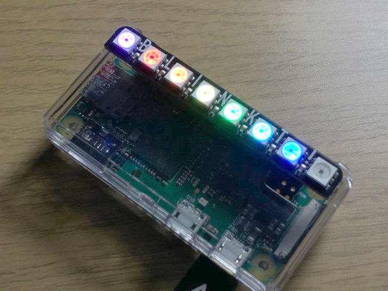
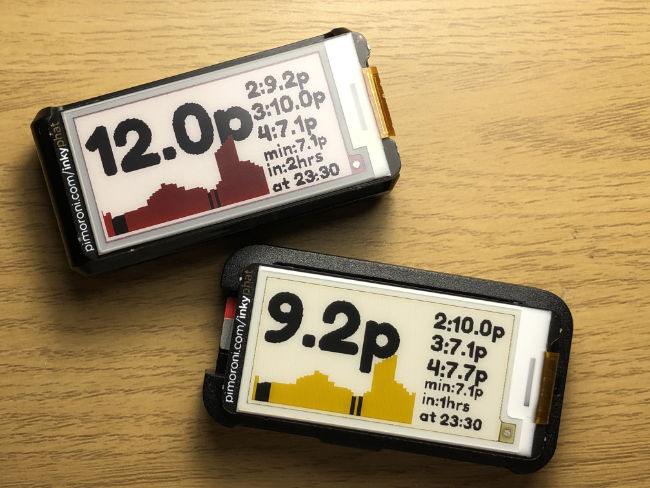

# agile-pi-ndicator
Display upcoming Octopus Agile prices on a Raspberry Pi, fitted with either a [Pimoroni Blinkt!](https://shop.pimoroni.com/products/blinkt) LED display or a [Pimoroni Inky pHAT](https://shop.pimoroni.com/products/inky-phat) display. There are no external dependencies at run-time, apart from an internet connection to fetch prices from Octopus's public API to store locally. It's designed to be simple to set up and use for people with no coding knowledge.

Should you wish to purchase a preconfigured device, I have an [Etsy shop here](https://www.etsy.com/uk/listing/968401316/octopus-energy-agile-tariff-price).

## Working with Blinkt!



Read it from left to right. Each pixel represents a half hour slot, so you get 3.5 to 4 hours of data depending on when you look at it! The leftmost pixel represents the current price. On the half hour, every half hour, everything shifts one pixel to the left.

Magenta is the most expensive, then red if it's under 28p, orange if it's under 17p, yellow if it's under 13.5p, green if it's under 10p, cyan if it's under 5p, and blue if it's a plunge. You can change these quite easily by editing a config file.

## Working with Inky pHat



The large text is the current price, the top right numbers are the next three slots, then underneath that is today's minimum price and when that will be.

## Hardware needed

- Any Raspberry Pi with a 40 pin GPIO header and internet connectivity. This has been tested on a Pi Zero W and a Pi 3B+.
- [Pimoroni Blinkt!](https://shop.pimoroni.com/products/blinkt) or [Pimoroni Inky pHAT](https://shop.pimoroni.com/products/inky-phat) in red or yellow.

## Software needed

- This has been tested on Raspberry Pi OS Buster only.
- You will need *git* and *python 3* available. These are normally installed with Raspberry Pi OS anyway.
- You will need the Python libraries for the two displays, https://github.com/pimoroni/blinkt and https://github.com/pimoroni/inky
  You can install these libraries directly by entering the following at the Pi command line. Always check that you trust the source of any library (these commands are direct from Pimoroni who make the hardware) and answer **YES** to the questions.
```sh
curl https://get.pimoroni.com/blinkt | bash
curl https://get.pimoroni.com/inky | bash
```

## How to get this code
Once you have installed the Blinkt! software as above, the easiest way to download this software is to copy and paste the following command, which will make a copy of all the files in a folder called **agile-pi-ndicator** in your home directory. This won't work unless you've installed the libraries above (or installed `git` yourself).

```sh
cd ~ && git clone --depth 1 https://github.com/nanoamp/agile-pi-ndicator.git
```

## How to use this code

This code runs unprivileged - no `sudo` access is required. It will drop a SQLite database file in its own directory when it runs.

You will need to know your DNO region letter. Regions don't always map onto normal geographical areas (for instance Coventry counts as East Midlands, not West Midlands). You may find [Western Power's search tool](https://www.westernpower.co.uk/our-network/distribution-area-search) useful, or be able to see the letter towards the end of the *Unit rates* URL shown in the Quick start section of your [Octopus Energy API page](https://octopus.energy/dashboard/developer/) after signing in.

[DNO region](https://en.wikipedia.org/wiki/Distribution_network_operator):
A = East England
B = East Midlands
C = London
D = North Wales, Merseyside and Cheshire
E = West Midlands
F = North East England
G = North West England
P = North Scotland
N = South and Central Scotland
J = South East England
H = Southern England
K = South Wales
L = South West England
M = Yorkshire

You should initially run manually to check everything works, replacing X with your DNO region letter:
```sh
./store_prices.py --region X
```

The code will tell you what it's doing and whether it worked. You can run this as many times as you like without causing too many problems. 

To update the display, run:

```sh
./update.py
```

This will also tell you what it's doing. If you want to see all the colours available on a Blinkt! display, you can run 

```sh
./update.py --demo
```

If it's all a bit much, you can blank the display:

```sh
./clear.py
```

## Running automatically
I really can't be bothered to make a systemd timer/service for this. `cron` is so much easier!
I've included a script to install the cron jobs listed below. Run it like this, replacing X with your region:
```sh
./install_crontab.sh X
```
You can check it's worked by running `crontab -l`, you should see this:
```sh
@reboot /bin/sleep 30; cd /home/pi/agile-pi-ndicator && /usr/bin/python3 store_prices.py --region X > ./logs/agile.log 2>&1
@reboot /bin/sleep 40; cd /home/pi/agile-pi-ndicator && /usr/bin/python3 update_blinkt.py > ./logs/agile.log 2>&1
*/30 * * * * /bin/sleep 5; cd /home/pi/agile-pi-ndicator && /usr/bin/python3 update.py > ./logs/agile.log 2>&1
30 16 * * * cd /home/pi/agile-pi-ndicator && /usr/bin/python3 store_prices.py --region X > ./logs/agile.log 2>&1
30 18 * * * cd /home/pi/agile-pi-ndicator && /usr/bin/python3 store_prices.py --region X > ./logs/agile.log 2>&1
30 20 * * * cd /home/pi/agile-pi-ndicator && /usr/bin/python3 store_prices.py --region X > ./logs/agile.log 2>&1
```
- line 1: wait 30 seconds at startup, get new prices
- line 2: wait a further 10 seconds at startup and update the display
- line 3: wait till 5 seconds past every half hour and update the display
- lines 4, 5, and 6: update the price database at 4.30pm, 6.30pm, and 8.30pm (to cover late arrival of data)

## Troubleshooting

If something isn't working, run 
```sh
less ~/agile-pi-ndicator/logs/agile.log
```
This will show you the most recent message from any of the scripts (that were run automatically by `cron`). If this doesn't shed any light, run `./store_prices.py` and `./update.py` and see what they moan about!

## Customising Blinkt!

If you want to change price thresholds or fine-tune the colours, they are located in `blinkt_config.py`. Open it using `nano blinkt_config.py` or your favourite editor. 

### Colours
Look for this part:
```python
COLOUR_MAP = { 'level6': { 'r': 155, 'g': 0, 'b': 200, 'name': 'magenta' },
              'level5': { 'r': 255, 'g': 0, 'b': 0, 'name': 'red' },
              'level4': { 'r': 255, 'g': 30, 'b': 0, 'name': 'orange' },
...
```
**Don't change the names of the levels**. You can change the numbers and the named colours (which are only there to be human-readable in logs) but please don't change anything else. Any number between 0 and 255 is fine, anything else may produce "interesting" results. 0 means none of that colour, 255 means all of it (modified by the `BRIGHTNESS` setting further up the file). You can test the colours after saving your changes by running `./update.py --demo` and always find the original values on the github site.

### Price thresholds
Look for this part:
```python
    if price > 28:
        pixel_colour = 'level6'

    elif 28 >= price > 17:
        pixel_colour = 'level5'

    elif 17 >= price > 13.5:
        pixel_colour = 'level4'
...
```
**Don't change the names of the levels**. Change the price numbers and nothing else. The main thing to be sure of here is you don't have any gaps or overlaps in the price bands - you'll end up with undefined behaviour at that point.

## To Do:

- better retry if data is late, 3 cron jobs is hacky
- colour thresholds could depend on daily average rather than fixed values
- log rotation

## Thanks to:

Garry Hayne on the Octopus Agile forums (https://forum.octopus.energy) for the original idea  
pufferfish-tech's **octopus-agile-pi-prices** for inspiration (https://github.com/pufferfish-tech/octopus-agile-pi-prices)
